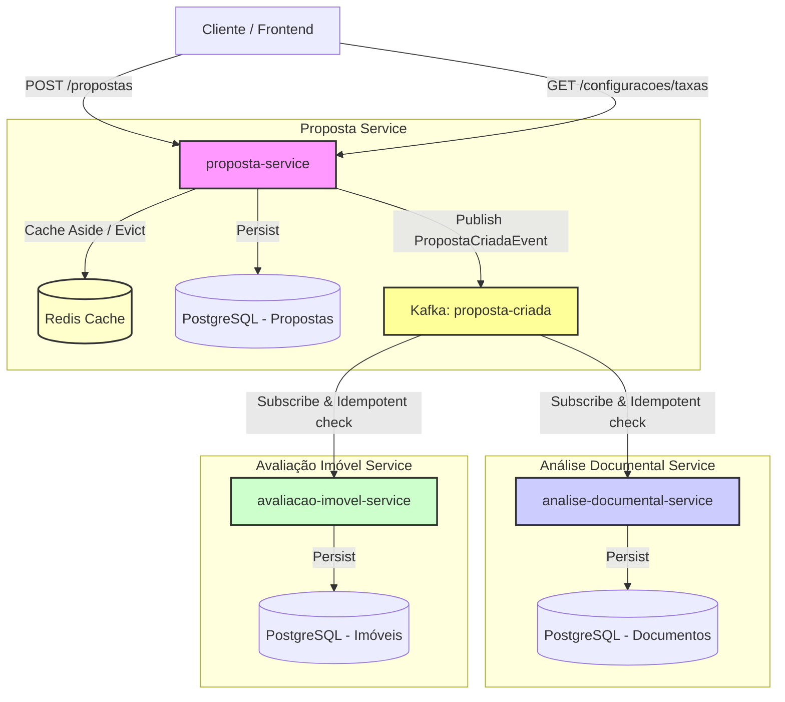

# Roteiro de Implementação: Jornada de Financiamento Habitacional (Quarkus)

Este documento descreve a arquitetura, a divisão de tarefas entre os 3 integrantes do grupo, as escolhas tecnológicas e o passo a passo para a entrega do projeto final da Caixa, utilizando **Quarkus (Reativo)**, **Kafka**, **Redis** e **Pact**.

---

## 1. Visão Geral da Arquitetura

O sistema é composto por **3 microsserviços reativos** com bancos de dados PostgreSQL segregados, comunicando-se de forma assíncrona via **Apache Kafka** e cacheando dados estáticos de alta consulta no **Redis**.



---

## 2. Divisão de Papéis e Responsabilidades (3 Integrantes)

Para atender aos requisitos do [brief-alunos.md](file:///C:/Users/Gabriel/Documents/GitHub/1705-be-jv-010/projetos/projeto-final-grupo/brief-alunos.md) de forma colaborativa, o trabalho foi dividido em 3 perfis complementares:

### 👤 Integrante 1: Arquiteto de Propostas & Cache
*   **Domínio:** `proposta-service`
*   **Responsabilidades:**
    *   Setup do projeto Maven multi-módulo (root `pom.xml`, estrutura de diretórios e configurações iniciais do Quarkus).
    *   Modelagem e persistência de Propostas no banco usando **Hibernate Reactive com Panache**.
    *   REST API para criação e consulta de propostas.
    *   Estratégia de Cache (Redis) para a tabela de taxas, modalidades e limites:
        *   Consulta com cache-aside (`@CacheResult`).
        *   Invalidação explícita (`POST /configuracoes/taxas/evict` ou `@CacheInvalidate`).

### 👤 Integrante 2: Especialista em Mensageria, Análise Documental & Idempotência
*   **Domínio:** `analise-documental-service`
*   **Responsabilidades:**
    *   Configuração do Kafka no Quarkus (`SmallRye Reactive Messaging`).
    *   Publicação do evento `PropostaCriadaEvent` pelo `proposta-service`.
    *   Consumo do evento no `analise-documental-service`.
    *   **Garantia de Idempotência:** Implementação de filtro/interceptador ou verificação no banco de dados para evitar reprocessamento do mesmo evento.
    *   Fluxo de análise de documentos (validação simulada e alteração de status).

### 👤 Integrante 3: Engenheiro de Testes de Contrato, Avaliação de Imóvel & Infra
*   **Domínio:** `avaliacao-imovel-service` & `shared-contracts`
*   **Responsabilidades:**
    *   Configuração do `docker-compose.yml` para infraestrutura local (PostgreSQL, Redis, Kafka).
    *   Consumo do evento `PropostaCriadaEvent` no `avaliacao-imovel-service` com lógica de avaliação de valor de imóvel e laudo.
    *   Criação do módulo `shared-contracts` para compartilhar os DTOs de eventos e contratos do Pact.
    *   Implementação do **Teste de Contrato (Pact)**:
        *   Garantir a conformidade do evento `PropostaCriadaEvent` enviado pelo `proposta-service` (Provider) e consumido pelos serviços downstream (Consumers).
    *   Consolidação do `README.md` arquitetural, `docs/arquitetura.md` e do `AVALIACAO.md`.

---

## 3. Roteiro Interativo de Implementação (Roadmap)

Abaixo está o checklist de entrega. Atualize o status à medida que avançar nas sprints.

| Fase | Descrição | Responsável | Status | Entregável / Evidência |
| :--- | :--- | :--- | :---: | :--- |
| **Fase 1** | **Setup e Infraestrutura Inicial** | Todos | ⬜ *Pendente* | Repositório estruturado, Maven configurado, Docker-compose operacional. |
| 1.1 | Criar a estrutura multi-módulo do Maven e `pom.xml` pai. | Integrante 1 | ⬜ | Estrutura de pastas criada. |
| 1.2 | Criar arquivo `docker-compose.yml` com Postgres (3 bases), Kafka e Redis. | Integrante 3 | ⬜ | Infra rodando via `docker-compose up -d`. |
| **Fase 2** | **Domínio da Proposta (CRUD & Cache)** | Integrante 1 | ⬜ *Pendente* | `proposta-service` funcional com banco de dados e cache Redis. |
| 2.1 | Implementar entidade `Proposta` e repositório Panache Reativo. | Integrante 1 | ⬜ | Persistência reativa no Postgres de propostas. |
| 2.2 | Criar endpoints REST reativos (`POST /propostas` e `GET /propostas/{id}`). | Integrante 1 | ⬜ | Endpoints testados via curl/HTTP. |
| 2.3 | Implementar lógica de taxas e limites com cache no Redis (Cache-Aside + Invalidação explícita). | Integrante 1 | ⬜ | Log de queries mostra que o banco só é consultado quando o cache expira/invalida. |
| **Fase 3** | **Mensageria e Idempotência (Assíncrono)** | Integrante 2 & 3 | ⬜ *Pendente* | Eventos trafegando via Kafka com consumo idempotente nos destinos. |
| 3.1 | Implementar a publicação de `PropostaCriadaEvent` no `proposta-service` usando SmallRye. | Integrante 2 | ⬜ | Evento publicado no Kafka após a persistência da proposta. |
| 3.2 | Criar `analise-documental-service` consumindo do Kafka. | Integrante 2 | ⬜ | Consumidor reativo configurado e recebendo mensagens. |
| 3.3 | Implementar controle de **idempotência** no `analise-documental-service` (tabela de eventos processados). | Integrante 2 | ⬜ | Teste integrado provando que reprocessar a mesma mensagem não gera duplicidade. |
| 3.4 | Criar `avaliacao-imovel-service` consumindo do Kafka. | Integrante 3 | ⬜ | Laudo gerado automaticamente para cada proposta recebida. |
| **Fase 4** | **Testes de Contrato & Robustez** | Integrante 3 | ⬜ *Pendente* | Contrato executável entre os serviços validado no build. |
| 4.1 | Definir o contrato do evento `PropostaCriadaEvent` usando Pact (Consumer Test). | Integrante 3 | ⬜ | Arquivo `.json` do Pact gerado pelo consumidor. |
| 4.2 | Configurar a verificação do contrato no `proposta-service` (Provider Test). | Integrante 3 | ⬜ | `mvn verify` validando o contrato de mensageria com sucesso. |
| **Fase 5** | **Documentação & Fechamento** | Todos | ⬜ *Pendente* | Documentação exigida pelo brief pronta para entrega. |
| 5.1 | Escrever as ADRs (Arquitetural Decision Records) em `docs/adr/`. | Todos | ⬜ | Decisões de Cache, Mensageria, Reatividade e Idempotência documentadas. |
| 5.2 | Preencher o arquivo `AVALIACAO.md` com as evidências do código. | Todos | ⬜ | Auto-avaliação respondida conforme rubrica. |

---

## 4. Stack Reativa de Referência (Quarkus)

Para que o desenvolvimento seja 100% alinhado com o modelo reativo (Mutiny), use as seguintes extensões e padrões:

### 4.1. Maven Dependências Reativas
No Quarkus, adicionamos as extensões correspondentes no `pom.xml` de cada serviço:

*   **REST Reativo:** `quarkus-resteasy-reactive-jackson`
*   **Banco de Dados Reativo (Reactive Panache):** `quarkus-hibernate-reactive-panache` e `quarkus-reactive-pg-client`
*   **Mensageria Reativa (Kafka):** `quarkus-messaging-kafka`
*   **Cache:** `quarkus-cache` e `quarkus-redis-client`
*   **Validação:** `quarkus-hibernate-validator`
*   **Testes de Contrato:** `pact-jvm-consumer-junit5` e `pact-jvm-provider-junit5`

### 4.2. Exemplo de Código Reativo (Mutiny)

**Persistência Reativa (Panache):**
```java
@ApplicationScoped
public class PropostaRepository implements PanacheRepository<Proposta> {
    
    public Uni<Proposta> criarProposta(Proposta proposta) {
        return persist(proposta);
    }
}
```

**REST Endpoint Reativo:**
```java
@Path("/propostas")
@Produces(MediaType.APPLICATION_JSON)
@Consumes(MediaType.APPLICATION_JSON)
public class PropostaResource {

    @Inject
    PropostaRepository repository;

    @Inject
    @Channel("proposta-criada")
    Emitter<PropostaCriadaEvent> emitter;

    @POST
    @ReactiveTransactional
    public Uni<Response> criar(Proposta proposta) {
        return repository.criarProposta(proposta)
            .flatMap(saved -> {
                PropostaCriadaEvent event = new PropostaCriadaEvent(saved.id, saved.clienteNome, saved.valorImovel);
                // Envia o evento de forma assíncrona ao Kafka
                return Uni.createFrom().completionStage(emitter.send(event))
                    .replaceWith(Response.status(Status.CREATED).entity(saved).build());
            });
    }
}
```

---

## 5. Estratégia de Perfis de Execução (A/B/C)

*   **Perfil A (Docker / Produção Local):**
    *   Requer Docker instalado.
    *   Subir o ambiente com `docker-compose up -d`.
    *   Executar as aplicações via `mvn quarkus:dev`. O Quarkus se conectará ao Kafka, Postgres e Redis mapeados no docker-compose.
*   **Perfil B (JVM Puro / Fallback Sem Docker):**
    *   Caso algum integrante tenha problemas com o Docker, o Quarkus permite configurar **Bancos Em-Memória (H2)** e **Kafka InMemory** (SmallRye permite Mock de canais).
    *   Para o cache do Redis, podemos configurar o `@CacheResult` para usar o cache padrão baseado na JVM (Caffeine) se o Redis não estiver acessível, garantindo que o build passe puramente na JVM.
*   **Perfil C (Conceitual):**
    *   Diagramas, documentação de arquitetura e código-fonte, mesmo sem conseguir rodar na máquina de desenvolvimento.

---

## Próximos Passos
1. Integrante 1 inicia a criação da estrutura de diretórios e o `pom.xml` raiz.
2. Integrante 3 cria o repositório Git e disponibiliza o `docker-compose.yml` inicial.
3. Alinhamento sobre o contrato do evento `PropostaCriadaEvent` na pasta `shared-contracts`.
