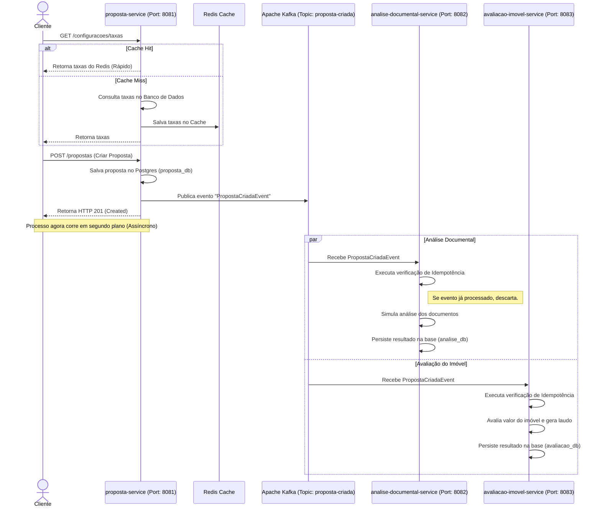

# Visão de Arquitetura

Este documento detalha o fluxo de eventos e decisões de design da **Jornada de Financiamento Habitacional**.

## Diagrama de Contextos e Fluxo de Eventos

## Tecnologias e Trade-offs

1.  **Quarkus Reativo (Mutiny):** Escolhido para maximizar a taxa de transferência e a eficiência de recursos nas requisições I/O intensivas (banco de dados, Redis, Kafka).
2.  **PostgreSQL Segregado:** Cada serviço possui sua própria base de dados (`proposta_db`, `analise_db`, `avaliacao_db`). Isso impede acoplamento por dados e permite que cada microsserviço evolua seu esquema de forma independente.
3.  **Apache Kafka:** Broker de mensageria assíncrona robusto que permite que a criação da proposta seja instantânea para o cliente final, desacoplando o fluxo de análise e avaliação.
4.  **Redis (Cache-Aside):** Utilizado para tabelas altamente lidas com alterações infrequentes (como taxas de juros e modalidades), diminuindo significativamente a latência e o consumo do banco de dados relacional.
